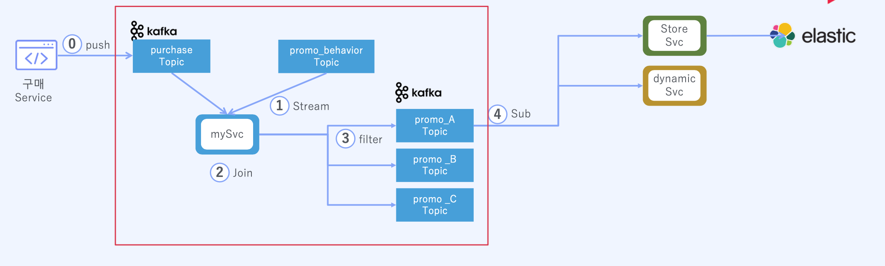
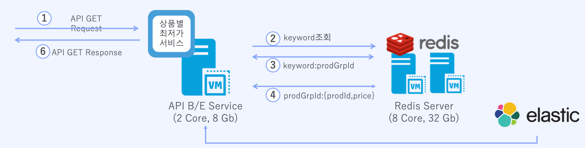

# PricePulse

## 프로젝트 개요
실시간으로 광고 효과를 분석하고 제품의 최저가를 고객에게 제공 해보자

## 기술 스택
- **JDK**: OpenJDK 17
- **Framework**: Spring Boot 3.0.1
- **Caching**: Redis 7
- **MessageQueue**: Kafka
- 
## 광고효과 분석

## 최저가 검색

## 주요 기능

- **1. 실시간 광고 효과 분석 (Kafka)**:
  - Kafka를 사용하여 광고 시청 로그(adLog)와 구매 로그(purchaseLog)를 실시간으로 수집한다.
  - Kafka Streams API를 활용하여 광고 시청 데이터와 구매 데이터를 사용자 ID와 제품 ID를 기준으로 조인한다.
  - 특정 조건(예: 시청 시간이 10초 이상, 제품 가격이 100만 원 이하)을 만족하는 데이터만 분석에 사용하여, 효과적인 광고와 비효과적인 광고를 구분한다.
  - 분석 결과를 AdEvaluationComplete 토픽에 발행하여, 다른 시스템에서 광고 효과를 모니터링하고 분석할 수 있도록 한다.

- **2. 제품 가격 비교 및 최저가 검색 (Redis):**
  - Redis를 사용하여 제품 및 제품 그룹의 가격 정보를 ZSet 자료 구조로 저장한다.
  - 다양한 Redis 명령을 사용하여 특정 키워드에 대한 제품을 조회하고, 최저가 제품을 빠르게 찾아 제공한다.

